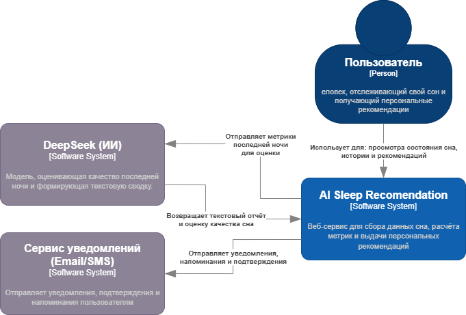
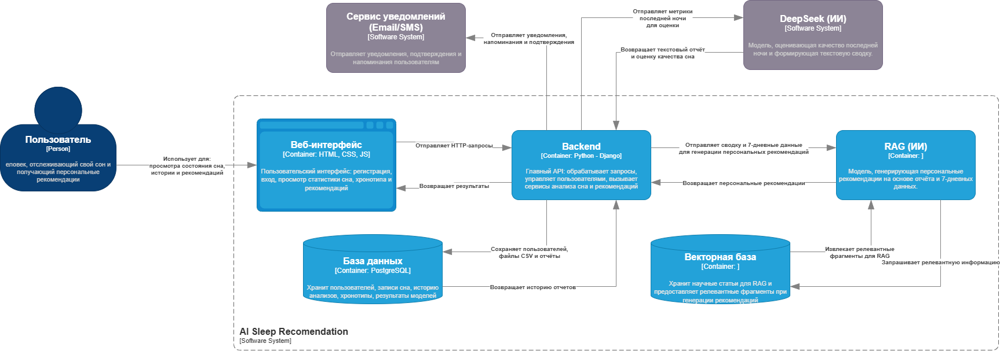

# C4 диаграммы

## 1. Контекстная диаграмма (C1)

### Диаграмма

### Описание

#### Участники

**Пользователь** - Человек, отслеживающий качество своего сна и получающий персональные рекомендации.

**Основная система: AI Sleep Recommendation**  - Веб-сервис для сбора данных сна, расчета метрик и выдачи персональных рекомендаций.

**Внешние системы:**

- **DeepSeek (ИИ)** - Модель, котрая на основе переданных данных оценивает качество сна последней ночи и формирует текстовый отчёт о последней ночи.
- **Сервис уведомлений (Email/SMS)** - Отправляет пользователю уведомления, подтверждения и напоминания.

#### Связи

| Отправитель | Получатель | Содержание взаимодействия |
| --- | --- | --- |
| Пользователь | AI Sleep Recommendation | Запросы на просмотр состояния сна, истории и персональных рекомендаций |
| AI Sleep Recommendation | DeepSeek (ИИ)           | Отправка метрик последней ночи |
| DeepSeek (ИИ)           | AI Sleep Recommendation | Возврат текстового отчёта и оценки сна |
| AI Sleep Recommendation | Сервис уведомлений | Отправка уведомлений, напоминаний и подтверждений пользователю |

---

## 2. Уровень 2: Контейнеры (Containers)

---

## 3. Уровень 3: Компоненты (Components)

